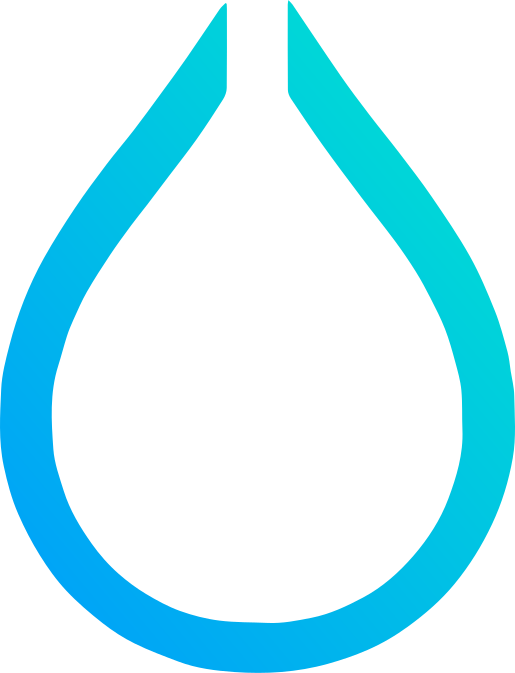

<h1 align='center'>Welcome! I'm a Canadian/Brazilian developer! 😸</h1>

  

<h2 align='center'>Toolbox</h2>

  &nbsp;
  &nbsp;
  &nbsp;
  &nbsp;
  &nbsp;
  &nbsp;
  &nbsp;
  &nbsp;
  &nbsp;
  &nbsp;
  &nbsp;
  &nbsp;

<h2 align='center'>Dev Stack</h2>

  &nbsp;
  &nbsp;
  &nbsp;
  &nbsp;

<h2 align='center'>Contact</h2>

<a href='mailto:antonkoetzler-faust@hotmail.com'>antonkoetzler-faust@hotmail.com</a>

&nbsp;

Account where I store my old code: https://github.com/antonkoetzler-archive

