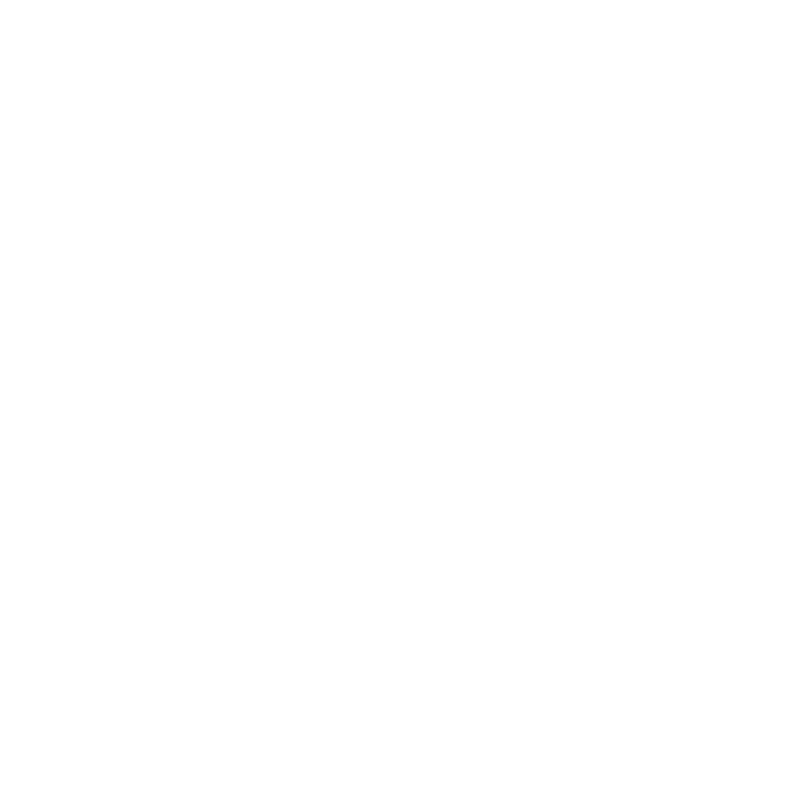
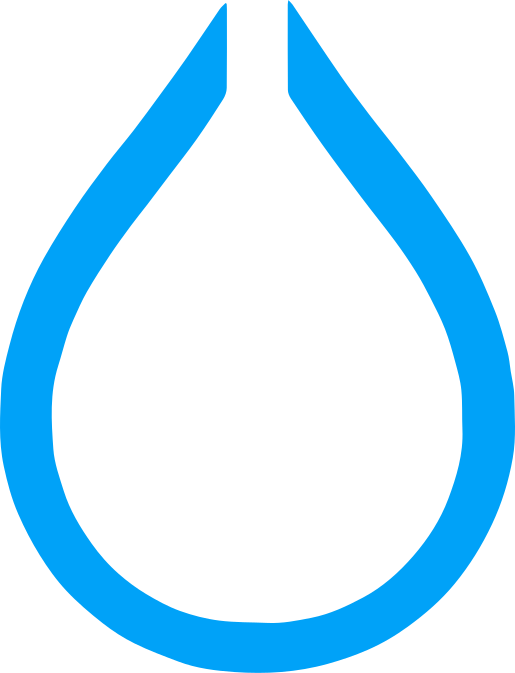
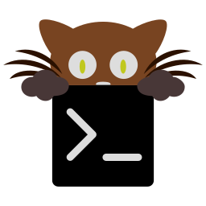

<h1 align='center'>Welcome! I'm a Canadian/Brazilian developer! 😸</h1>

  

<h2 align='center'>Tech Stack</h2>

  &nbsp;
  &nbsp;
  &nbsp;
  &nbsp;
  &nbsp;
  &nbsp;
  &nbsp;
  &nbsp;
  &nbsp;
  &nbsp;
  &nbsp;
  &nbsp;
  &nbsp;
  &nbsp;
  &nbsp;
  &nbsp;
  &nbsp;
  

<h2 align='center'>Dev Stack</h2>

  &nbsp;
  &nbsp;
  &nbsp;
  

<h2 align='center'>What I am working on right now?</h2>

<a href='https://github.com/antonkoetzler/myoro_api'>MyoroAPI</a>: Centralized database for all of my applications

<a href='https://github.com/antonkoetzler/MyoroFitness'>Myoro Fitness</a>: A beautiful & feature rich finance application

<h2 align='center'>Contact</h2>

<a href='mailto:antonkoetzler-faust@hotmail.com'>antonkoetzler-faust@hotmail.com</a>

<h2 align='center'>Miscellaneous</h2>

<a href='https://github.com/antonkoetzler-archive' align='center'>Account where I store my old code</a>

