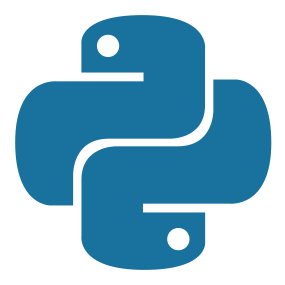

# Welcome

Canadian/Brazilian lad writing cross-platform FOSS & scripts 😎 Check out my operation [Myoro](https://github.com/Myoro)!

## Specializing in

## My Toolbox ~ The Blue Stack 🌊

&nbsp;&nbsp;&nbsp;&nbsp;&nbsp;&nbsp;&nbsp;&nbsp;&nbsp;&nbsp;&nbsp;&nbsp;&nbsp;&nbsp;&nbsp;&nbsp;&nbsp;&nbsp;&nbsp;&nbsp;&nbsp;&nbsp;

## Contact

**Email:** <antonkoetzler-faust@hotmail.com>
