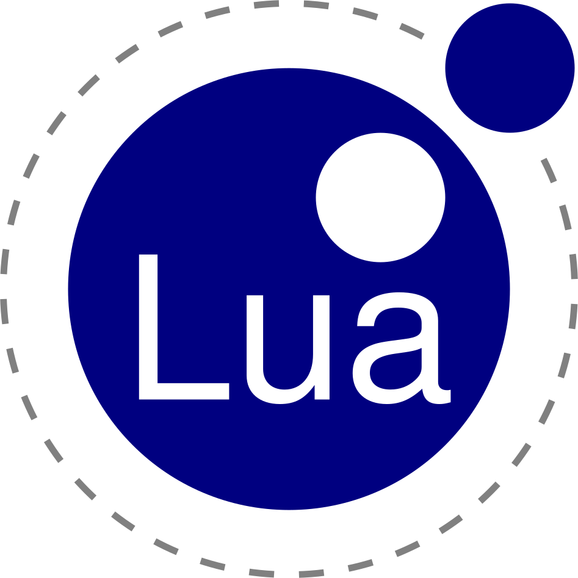

# Welcome

Canadian/Brazilian lad writing cross-platform FOSS & scripts 😎

## My Toolbox ~ The Blue Stack 🌊

&nbsp;&nbsp;&nbsp;&nbsp;&nbsp;&nbsp;&nbsp;&nbsp;&nbsp;&nbsp;&nbsp;&nbsp;

## My setup
1. **OS:** Arch linux;
2. **Window manager:** i3;
3. **Editor:** nvim;
4. **Terminal:** Gnome terminal;

## Contact

**Email:** <antonkoetzler-faust@hotmail.com>

## Account where I store my old code.
https://github.com/antonkoetzler-archive
