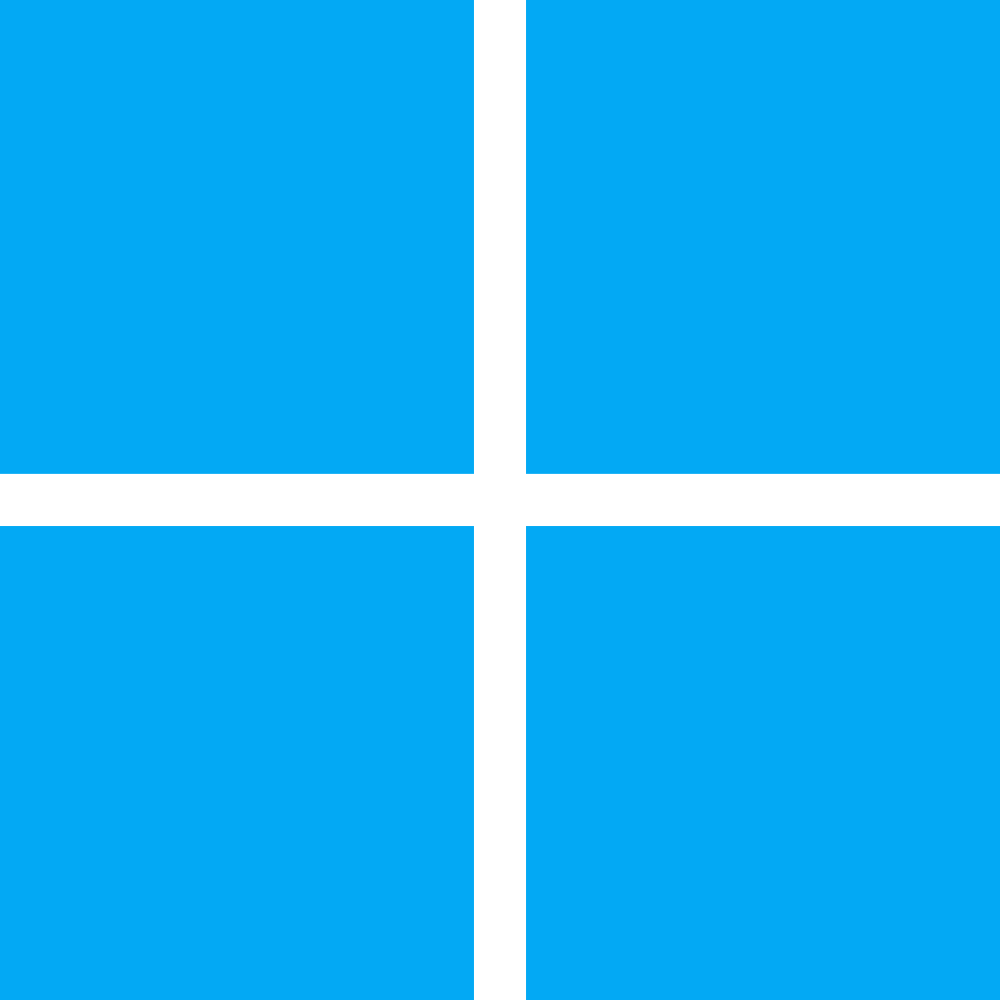

<h1 align='center'>Welcome! 😸</h1>

  

Programmer 👨‍💻 & fighting game player 🥊

Myoro is my mission to create better technology 🫡

Half-Canadian and half-Brazilian!

<h2 align='center'>Languages</h2>

  &nbsp;
  &nbsp;
  

<h2 align='center'>Tech Stack</h2>

  &nbsp;
  &nbsp;
  &nbsp;
  &nbsp;
  &nbsp;
  &nbsp;
  &nbsp;
  &nbsp;
  &nbsp;
  &nbsp;
  
  &nbsp;
  &nbsp;
  &nbsp;
  &nbsp;
  &nbsp;
  &nbsp;
  &nbsp;

<h2 align='center'>Development Environment</h2>

  &nbsp;
  &nbsp;
  &nbsp;
  &nbsp;
  &nbsp;
  &nbsp;
  &nbsp;
  

<h2 align='center'>AFFiNE Pages</h2>

- [**Anton’s Flutter Bible**](https://app.affine.pro/workspace/02defb85-8959-4667-9969-24a0f8b87a1d/Gd4J3n9gdqZyzosc2kvjd): My Flutter bible. Contains all of my standards and thoughts regarding Dart and Flutter;
- [**Myoro**](https://app.affine.pro/workspace/02defb85-8959-4667-9969-24a0f8b87a1d/CM4zyaYyuwv9W9jUozjXU): Documentation regarding my project Myoro;
- [**2XKO**](https://app.affine.pro/workspace/02defb85-8959-4667-9969-24a0f8b87a1d/Sj-XvLpHZSWrWR1qm4Za0): Documentation of my tech in 2XKO.

<h2 align='center'>Extra</h2>

- [Portfolio](https://antonkoetzler.github.io/);
- [Account where I store my old code](https://github.com/antonkoetzler-archive);
- Email: [antonkoetzler-faust@hotmail.com](mailto:antonkoetzler-faust@hotmail.com).
