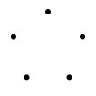
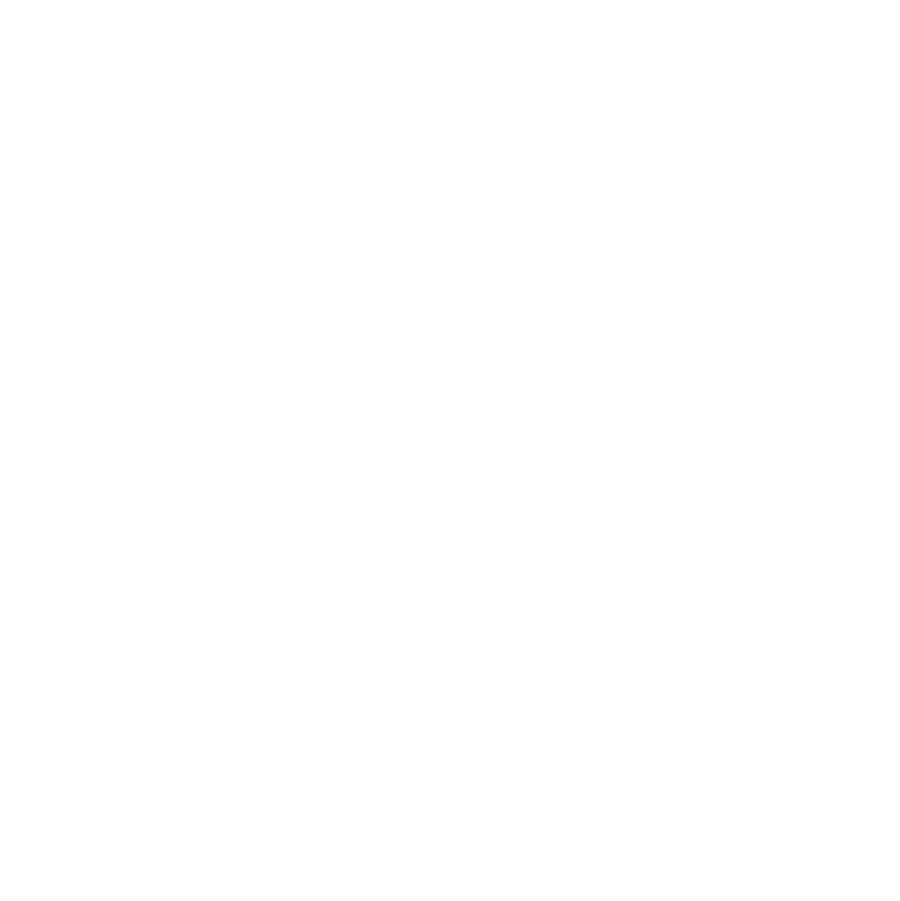
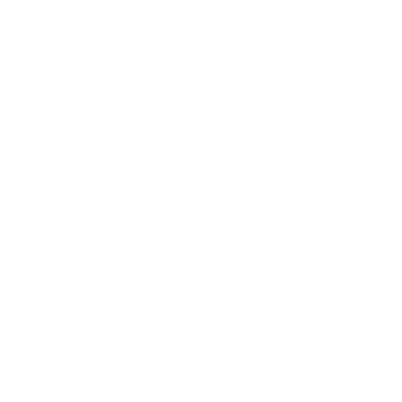
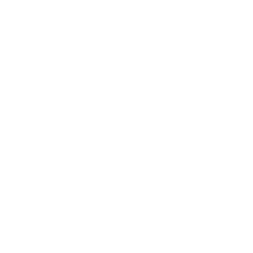
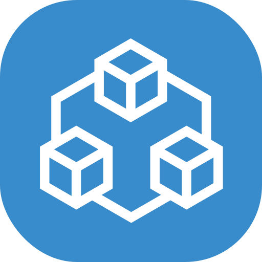
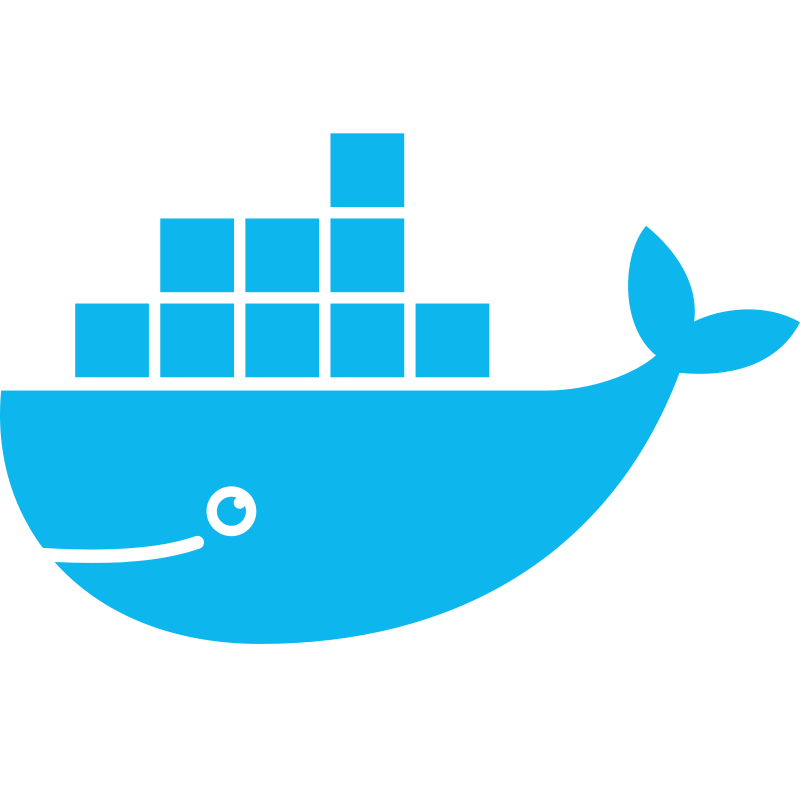
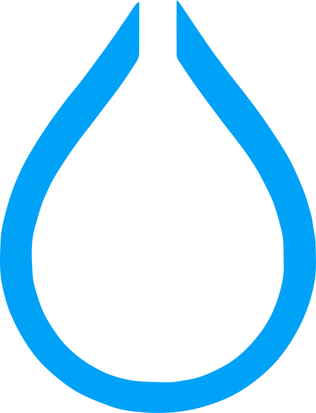
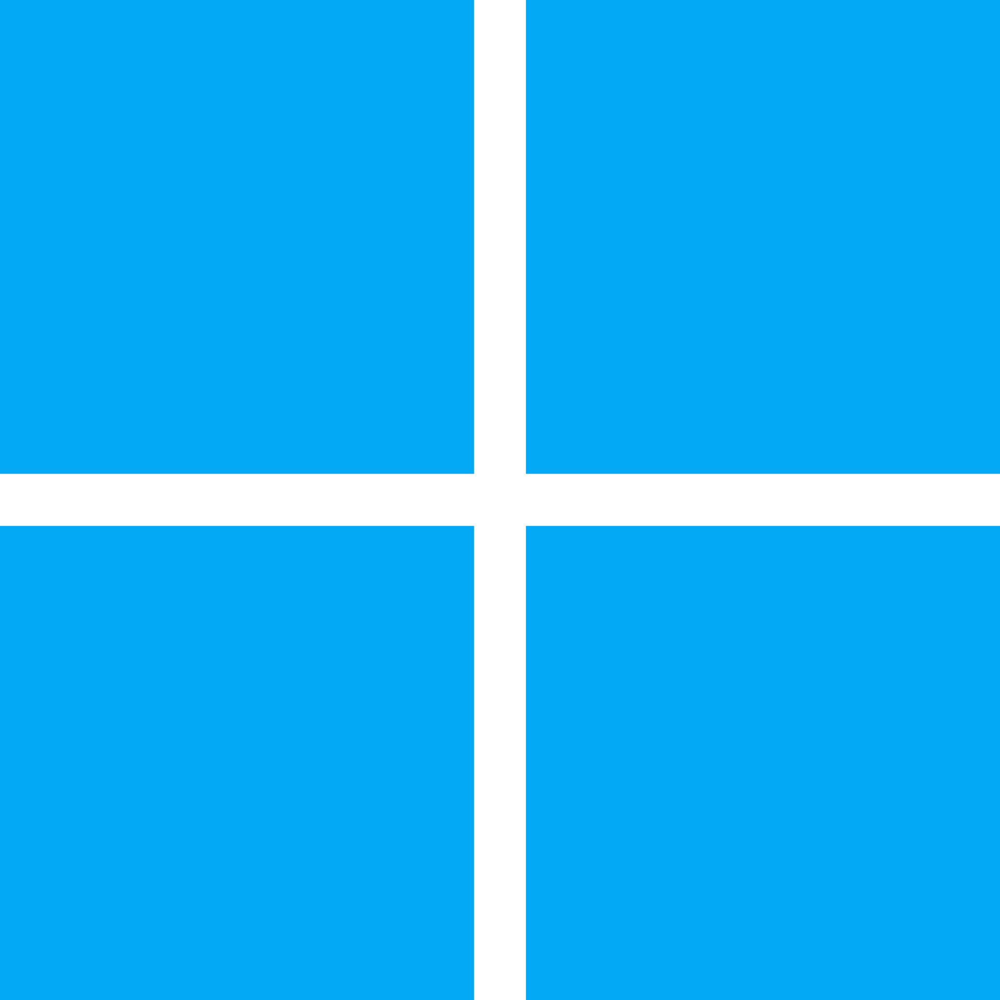
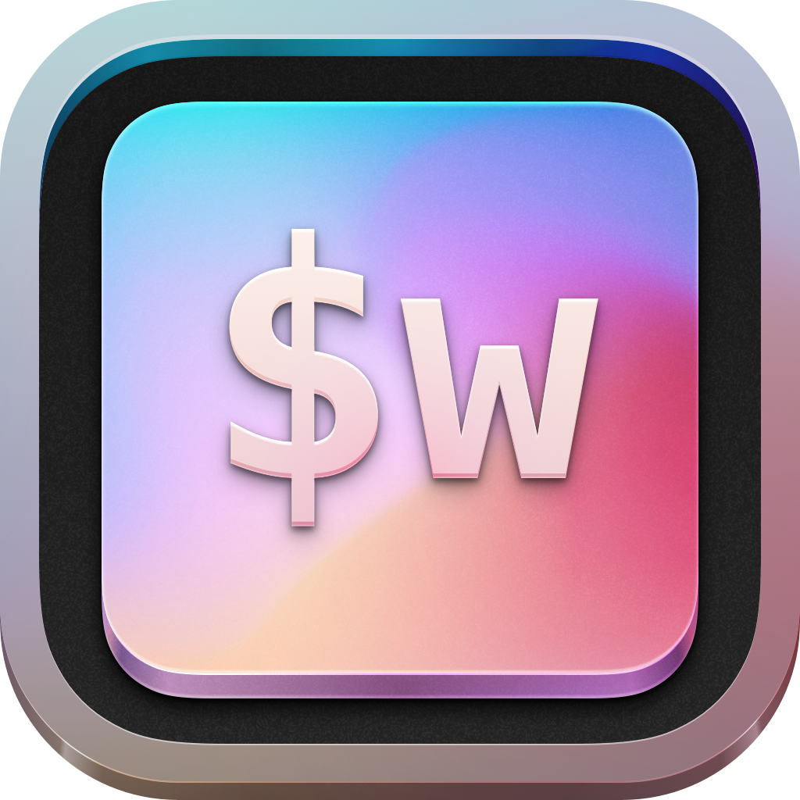

<h1 align='center'>Welcome! 😸</h1>

Programmer 👨‍💻 & fighting game player 🥊

Myoro is my mission to create better and more convenient software 🫡

Half-Canadian and half-Brazilian!

<h2 align='center'>Links</h2>

<a href='https://portfolio.myoro.com.br/'>Portfolio</a> | <a href='mailto:antonkoetzler-faust@hotmail.com'>antonkoetzler-faust@hotmail.com</a>

<h2 align='center'>Languages</h2>

  &nbsp;
  &nbsp;
  &nbsp;
  &nbsp;
  

<h2 align='center'>Tech Stack</h2>

  &nbsp;
  &nbsp;
  &nbsp;
  &nbsp;
  &nbsp;
  &nbsp;
  &nbsp;
  &nbsp;
  &nbsp;
  &nbsp;
  &nbsp;
  &nbsp;
  &nbsp;
  &nbsp;
  &nbsp;
  &nbsp;
  &nbsp;
  &nbsp;
  

<h2 align='center'>Development Environment</h2>

  &nbsp;
  &nbsp;
  &nbsp;
  &nbsp;
  &nbsp;
  &nbsp;
  

