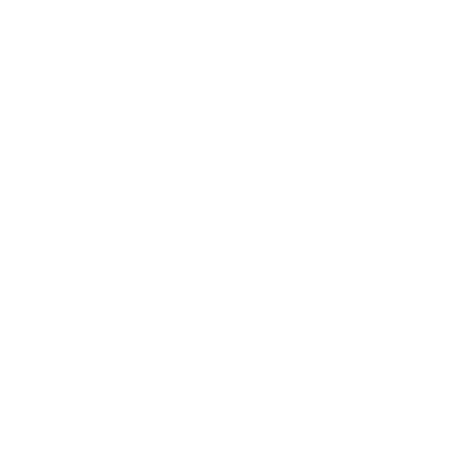

<h1 align='center'>Welcome! 😸</h1>

  

Programmer 👨‍💻 & fighting game player 🥊

Myoro is my mission to create better technology 🫡

Half-Canadian and half-Brazilian!

<h2 align='center'>Languages</h2>

  &nbsp;
  &nbsp;
  &nbsp;
  

<h2 align='center'>Frameworks & Libraries</h2>

  &nbsp;
  &nbsp;
  &nbsp;
  &nbsp;
  &nbsp;
  &nbsp;
  &nbsp;
  &nbsp;
  &nbsp;
  &nbsp;
  
  &nbsp;
  &nbsp;
  &nbsp;
  &nbsp;
  &nbsp;
  &nbsp;
  

<h2 align='center'>Development Environment</h2>

  &nbsp;
  &nbsp;
  &nbsp;
  &nbsp;
  &nbsp;
  &nbsp;
  &nbsp;
  

<h2 align='center'>Notion Pages</h2>

- [**Anton’s Flutter Bible**](https://tough-shoemaker-cbd.notion.site/Anton-s-Flutter-Bible-2b5d7dcd55248087bf5cd89888eca59e): My Flutter bible. Contains all of my standards and thoughts regarding Dart and Flutter;
- [**Myoro**](https://tough-shoemaker-cbd.notion.site/Myoro-2b5d7dcd552480df9b9aef40d0682c05): Documentation regarding my project Myoro;
- [**2XKO**](https://tough-shoemaker-cbd.notion.site/2XKO-2b5d7dcd5524801c8a02f137885b8ea1): Documentation of my tech in 2XKO.

<h2 align='center'>Extra</h2>

- [Portfolio](https://antonkoetzler.github.io/);
- [Account where I store my old code](https://github.com/antonkoetzler-archive);
- Email: [antonkoetzler-faust@hotmail.com](mailto:antonkoetzler-faust@hotmail.com).
